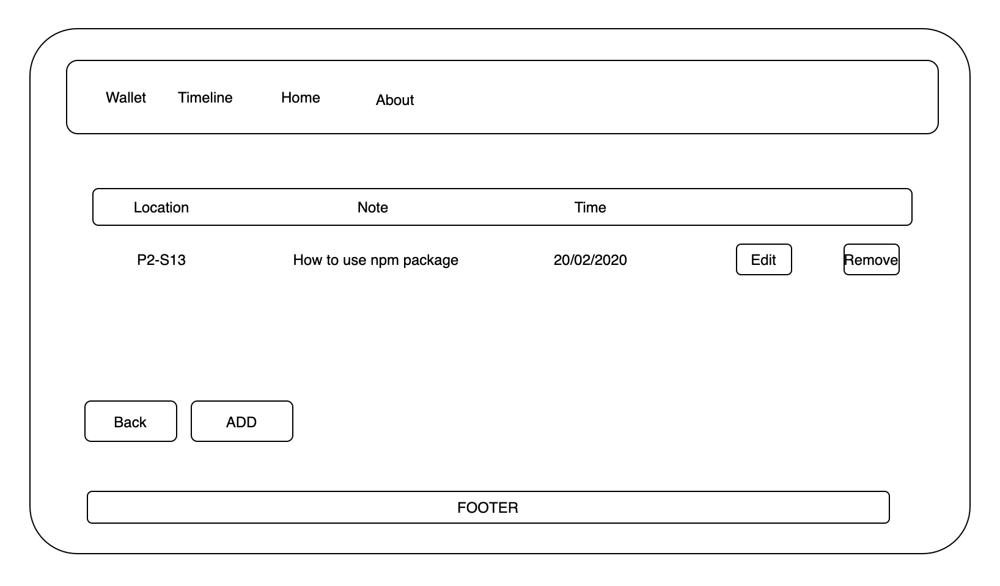

# Post & Read Wallet

* PR Wallet is an idea where it came from my struggling of reading articles. I read articles in daily routine, and sometime I read twice daily. I was using my iPhone and my iPad notes to add the links of articles to them, so I don't lose them. Recently, I have struggled in finding one links out of many and many articles in my notes, so I decided to leave those notes and move to make threads in Twitter. I start making a thread where I tweet my links under that thread, but I noticed it is going to be a mess when it get bigger and bigger with thousands of tweets. I decided to create a wallet with designed system and database so I can use it for only one purpose that is storing my articles and adding notes to them for future purposes. 

## How the webpages structured:

* There three 4 componoents including devise of auth. All componentet connected to each other as attached image below shows. The image also explain a bit how the models of components are connected.

## Database schema:
* Database schema has three MVC excluding the user devise. The relationship between poster and post is one-to-many, and poster has many notes through post where poster has many notes. Posts has many notes, and the relationship between them is one-to-many too.

## Wireframes:

* landing page as root:

* Registration page:

* Login Page:

* Timeline of all authors/Posters:

* Adding Author/Poster:

* All articles/posts of one specefic author/poster:

* Adding post under one specefic author/poster:

* Notes of one article under one author:

* Adding note to one artilces of one author:

